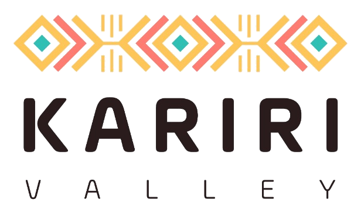
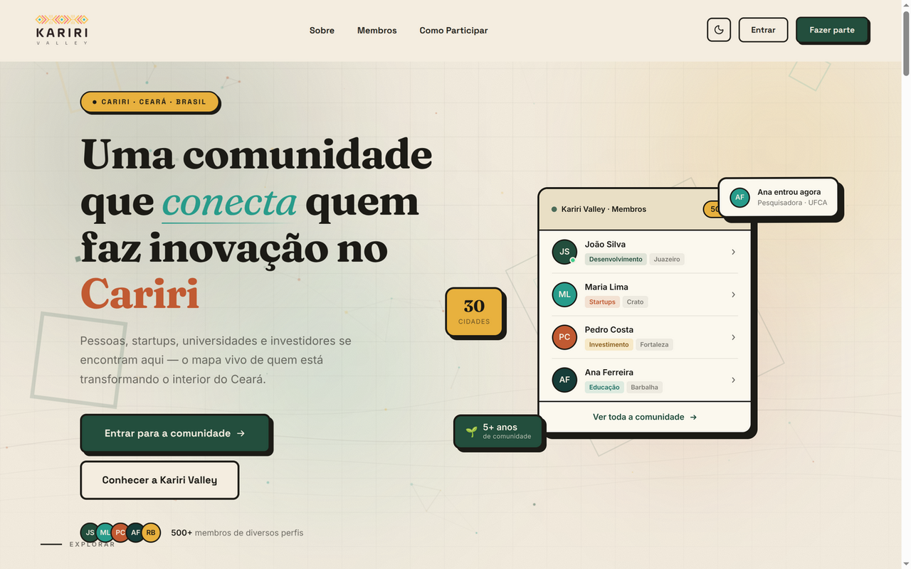
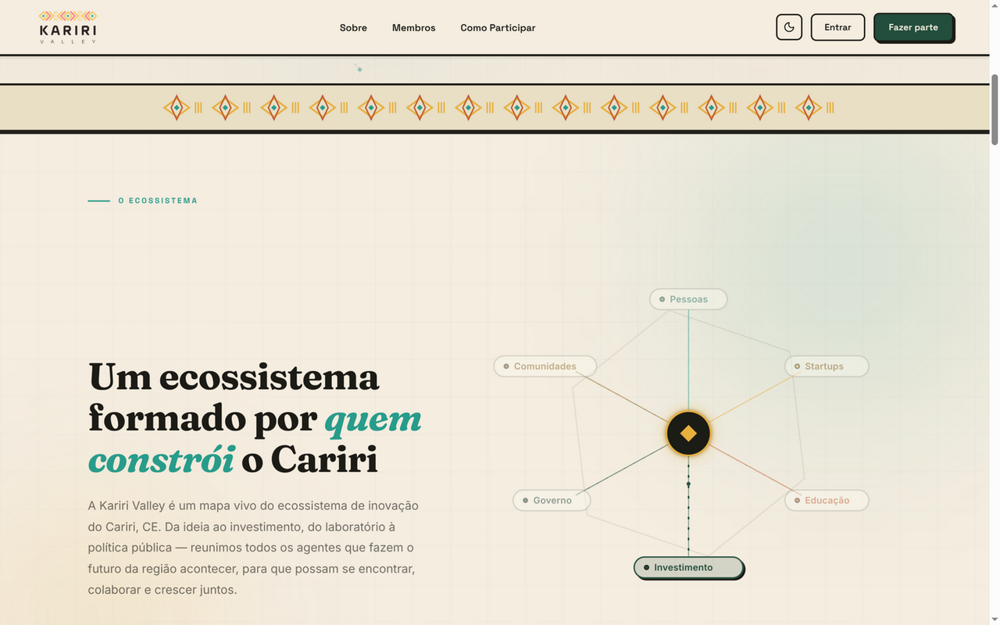
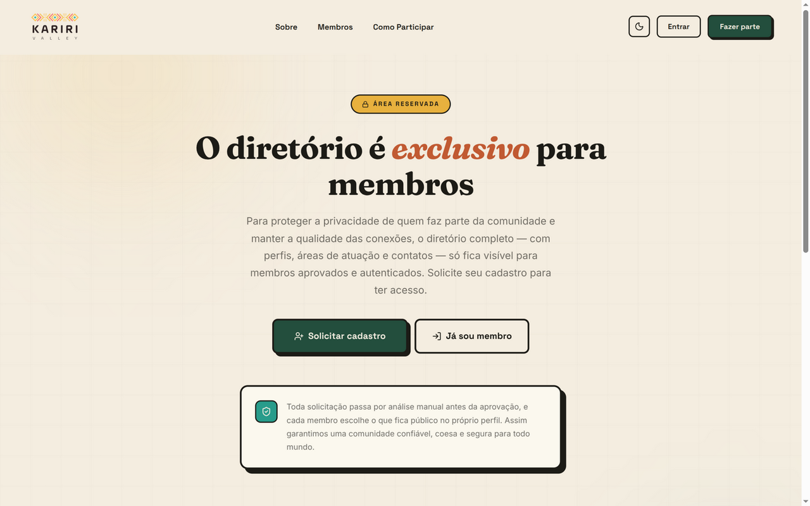

<div align="center">

<picture>
  <source media="(prefers-color-scheme: dark)" srcset="public/logo.png">
  
</picture>

### O mapa vivo da inovação no Cariri 🌵

**Kariri Valley** é a casa digital da comunidade de inovação do Cariri (CE). Conectamos **startups, talentos, empresas, universidades e instituições** para fortalecer o ecossistema da região — Juazeiro do Norte, Crato e Barbalha.

[](https://www.karirivalley.com.br)
[](https://nextjs.org)
[](https://supabase.com)
[](https://tailwindcss.com)
[](https://www.typescriptlang.org)
[](#-como-contribuir)

[🌐 Visite a plataforma](https://www.karirivalley.com.br) · [✨ Sobre a comunidade](https://www.karirivalley.com.br/sobre) · [🤝 Como participar](https://www.karirivalley.com.br/como-participar) · [📸 Instagram](https://www.instagram.com/karirivalley) · [💛 Contribuir](#-como-contribuir)



*A comunidade que constrói o Cariri — agora também digital.*

</div>

---

## 🧭 Sobre a Kariri Valley

No interior do Ceará, longe dos grandes polos de tecnologia do litoral, um movimento prova que inovação também floresce no sertão. A Kariri Valley nasceu em **2017** como um coletivo em **Juazeiro do Norte, Crato e Barbalha**, com encontros mensais e eventos abertos — de Fuck-up Nights a Startup Jua, de Campus Party Day ao Kariri Valley Day. Em **2018**, ajudou a pautar a **Lei Complementar nº 117/2018**, que reduziu impostos para empresas de base tecnológica no Cariri.

Hoje, a Kariri Valley é um **mapa vivo do ecossistema de inovação da região**: da ideia ao investimento, do laboratório à política pública, reunimos todos os agentes que fazem o futuro acontecer — para que possam se encontrar, colaborar e crescer juntos.

### Nossos pilares

| 💠 | Pilar | O que significa |
| --- | --- | --- |
| 🤝 | **Espírito de Comunidade** | Ações desenhadas de forma coletiva e descentralizada, por quem faz parte do ecossistema |
| 🌉 | **Colaboração Extra-Institucional** | Profissionais de empresas, universidades e governos diferentes trabalhando lado a lado |
| 🌱 | **Geração de Impacto Positivo** | Disseminar a cultura empreendedora como motor de transformação social do Cariri |

## ✨ O que a plataforma oferece

- 🗺️ **Mapa vivo do ecossistema** — rede interativa que conecta pessoas, startups, educação, investimento, governo e comunidades
- 👥 **Diretório de membros** — perfis curados com temas de interesse, o que cada pessoa **busca** e o que **oferece**
- 🏪 **Vitrine de empresas** — startups e empresas da região, com métricas como MRR e assinantes
- 📅 **Agenda de eventos** — meetups, hackathons, workshops e encontros da comunidade
- 💼 **Oportunidades** — vagas, editais, programas de aceleração, mentoria e bolsas em um só lugar
- 🔐 **Privacidade sob controle** — cada membro escolhe o que é público, visível só para membros ou privado
- 🛡️ **Curadoria de verdade** — cadastro em 7 etapas com aprovação manual: assim a comunidade permanece coesa e confiável
- 📊 **Painel administrativo** — aprovações, métricas de crescimento e gestão de conteúdo

<table>
  <tr>
    <td align="center"><br><sub><b>Um ecossistema formado por quem constrói o Cariri</b></sub></td>
    <td align="center"><br><sub><b>Diretório exclusivo — privacidade e curadoria</b></sub></td>
  </tr>
</table>

## 🛠️ Stack

| Camada | Tecnologia |
| --- | --- |
| Framework | [Next.js 16](https://nextjs.org) — App Router, Server Components |
| UI | [React 19](https://react.dev) · [Tailwind CSS 4](https://tailwindcss.com) · shadcn/ui + Base UI · lucide-react · recharts |
| Linguagem | [TypeScript 5](https://www.typescriptlang.org) |
| Backend | [Supabase](https://supabase.com) — Postgres com RLS, Auth, Storage e Edge Functions |
| Formulários | react-hook-form + zod |
| Deploy | [Vercel](https://vercel.com) |

## 🚀 Rodando localmente

**Pré-requisitos:** Node.js 20+, npm e uma conta gratuita no [Supabase](https://supabase.com).

```bash
# 1. Clone o repositório
git clone https://github.com/hemersoncoelho/karirivalley.git
cd karirivalley

# 2. Instale as dependências
npm install

# 3. Configure as variáveis de ambiente
cat > .env.local << 'EOF'
NEXT_PUBLIC_SUPABASE_URL=https://SEU-PROJETO.supabase.co
NEXT_PUBLIC_SUPABASE_PUBLISHABLE_KEY=sua-chave-publica-anon
EOF

# 4. Rode o projeto
npm run dev
```

Abra [http://localhost:3000](http://localhost:3000) 🎉

### Configurando o banco

1. Crie um projeto em [supabase.com](https://supabase.com) → *New project*
2. Aplique o schema no **SQL Editor**: rode as migrações de [`supabase/migrations/`](supabase/migrations) em ordem, ou execute o consolidado [`supabase/mvp_schema_full.sql`](supabase/mvp_schema_full.sql)
3. Copie a **URL** e a **anon key** do projeto (Settings → API) para o `.env.local`

<details>
<summary>📦 Opcional: mensagens de boas-vindas (e-mail + WhatsApp)</summary>

As Edge Functions em `supabase/functions/` enviam boas-vindas quando um membro é aprovado. Configure os secrets no projeto Supabase:

```bash
supabase secrets set WEBHOOK_SECRET=... RESEND_API_KEY=... UAZAPI_BASE_URL=... UAZAPI_TOKEN=...
```

- `send-email-welcome` — e-mail via [Resend](https://resend.com)
- `send-whatsapp-welcome` — mensagem via [UazAPI](https://uazapi.com)

</details>

<details>
<summary>⭐ Comandos disponíveis</summary>

| Comando | Ação |
| --- | --- |
| `npm run dev` | Servidor de desenvolvimento |
| `npm run build` | Build de produção |
| `npm run start` | Servidor de produção |
| `npm run lint` | Lint (ESLint) |

> ⚠️ Usamos **Next.js 16** — se você já conhece versões anteriores, confira as mudanças recentes da framework antes de contribuir.

</details>

## 🤝 Como contribuir

Este projeto é **construído em público, pelo Cariri e para o Cariri** — cada contribuição, do commit ao compartilhamento, faz diferença. Sua primeira pode ser pequena: uma correção de typo conta tanto quanto uma feature. 💛

```bash
# 1. Faça um fork do projeto

# 2. Crie sua branch a partir da main
git checkout -b feat/minha-contribuicao

# 3. Faça os commits seguindo Conventional Commits (em pt-BR)
git commit -m "feat: adiciona filtro por área de atuação no diretório"

# 4. Envie e abra um Pull Request para a main
git push origin feat/minha-contribuicao
```

**Padrões da comunidade:**

- 📝 Commits no formato [Conventional Commits](https://www.conventionalcommits.org/pt-br/) em português (`feat:`, `fix:`, `docs:`, `refactor:`…)
- 🖼️ Screenshots no PR quando a mudança afetar a interface
- 💬 Dúvidas e ideias de features: abra uma **issue** antes de codar algo grande

### Procurando por contribuições como as suas

| Área | Ideias |
| --- | --- |
| 🧪 Qualidade | Testes automatizados (E2E e unitários) |
| ♿ Acessibilidade | Auditoria, navegação por teclado, contraste |
| 🎨 Design/UX | Novos componentes, animações, dark mode |
| 🖼️ Social | Imagens OpenGraph dinâmicas para eventos e oportunidades |
| 📝 Docs | CONTRIBUTING.md, CODE_OF_CONDUCT.md, guias de setup |
| 🐛 Produto | Reporte bugs, proponha melhorias e novas features |

## 🌐 Junte-se à comunidade

**Você não precisa ser dev para fazer parte.** A Kariri Valley é para fundadores, estudantes, pesquisadores, mentores, investidores, líderes públicos e entusiastas — qualquer pessoa apaixonada por transformar o interior do Ceará.

- 🚀 **Participar da comunidade** → [karirivalley.com.br/como-participar](https://www.karirivalley.com.br/como-participar)
- 📸 **Acompanhar no Instagram** → [@karirivalley](https://www.instagram.com/karirivalley)
- 💻 **Contribuir com código** → este repositório (veja [como contribuir](#-como-contribuir))

## ⭐ Mostre seu apoio

Se a Kariri Valley inspira você, deixe uma ⭐ no repositório e compartilhe com quem constrói no Cariri. É um gesto pequeno que ajuda a comunidade a crescer.

---

<div align="center">

◆ ◆ ◆

**Feito com 🧡 no Cariri, Ceará — Brasil**
*De Juazeiro do Norte, Crato e Barbalha para o mundo.*

</div>
